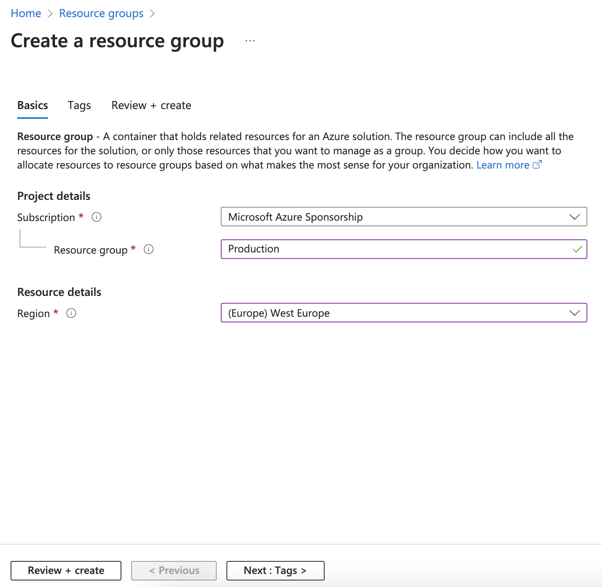
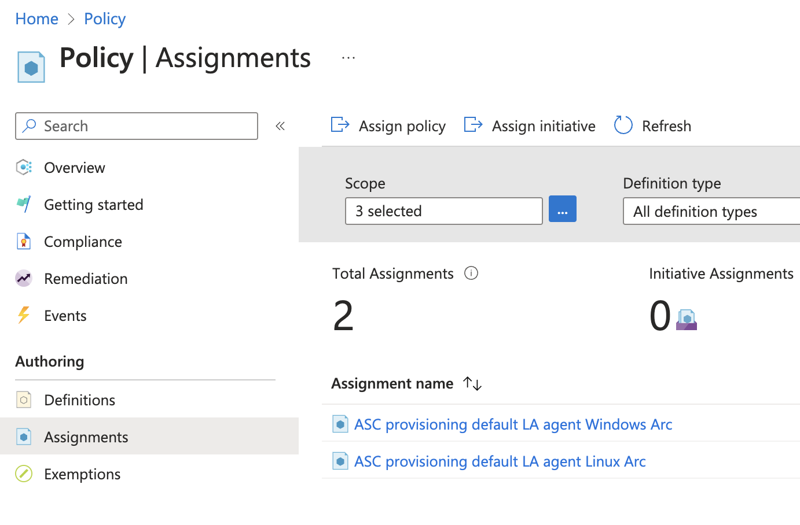
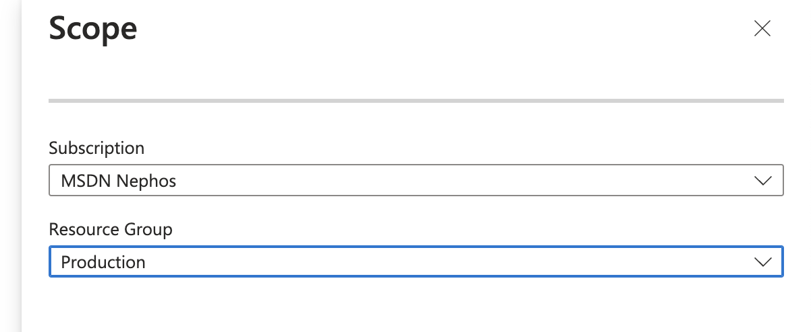
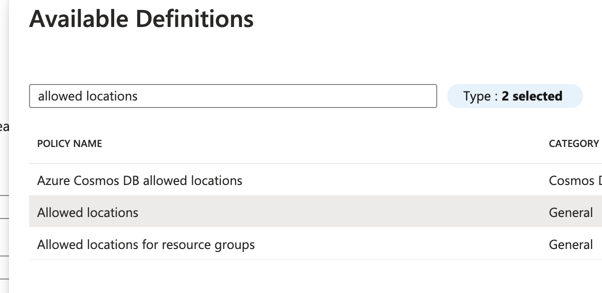
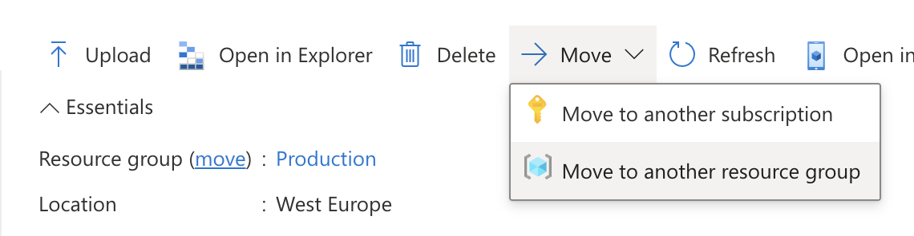
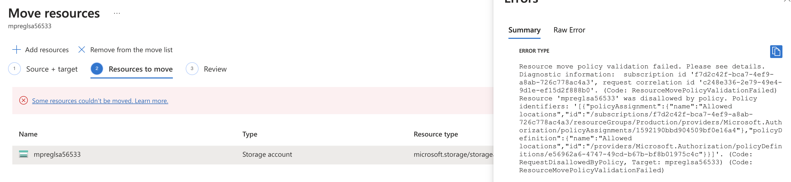

---
lab:
    title: '02 - Managing Azure'
    module: 'Azure Core'
---

# Lab 02 - Managing Azure

## Challenge scenario

You will learn fundamentals of Azure administration capabilities - login to portal, create and manage resource groups and create and manage resources. 

First try to solve the challenges on your own, in case you have trouble, click on the arrow left of the challenge for a detailed guide or ask facilitator for help.

## Objectives

In this lab, you will:

+ Create resource groups and deploy resources to resource groups
+ Use resource tags
+ Restrict deployment and deletion

## Challenges

  
Create 2 resource groups - Production (West Europe) and Test (North Europe)

1. In this task, you will use the Azure portal to create resource groups and create a disk in the resource group.

1. Sign in to the [**Azure portal**](http://portal.azure.com).

1. In the Azure portal, search for and select **Resource groups**, click **+ Create**:

1. Type resource group name ("Production") and select Region West Europe

1. Click **Review + Create** and then click **Create**.

  

    >**Note**: Wait until the resource group is created. This should take less than a minute.

1. Repeat for "Test" and deploy to North Europe

  

  
Tag a resource group with a tag Department "IT"

1. Open the resource group
1. Click Tags in the left menu
1. Type the following values

    |Name|Value|
    |---|---|
    |Department| IT |

1. Click Apply

  

  
Add a Storage account named "myfirststorageaccount" to Test resource group in North Europe

1. In the Azure portal, search for and select **Storage accounts**, click **+ Create**. Add the following settings

    |Setting|Value|
    |---|---|
    |Resource group| **Test** |
    |Storage account name| **myfirststorageaccount** |
    |Region| **North Europe** |
    |Redindancy| **Localy redundant storage** |

1. Note that storage accounts have to be globally unique. Pick a new unique name

1. Click **Review + Create** and then click **Create**.

  

  
Create a policy to only allow West Europe resources to be deployed to Production resource group

1. In the Azure portal, search for and select **Policies**

1. Click Assignments and Assign Policy
1. Apply the following settings

    |Setting|Value|
    |---|---|
    |Scope| your subscription and "Production" resource group |
    |Policy definition| Search for "Allowed locations" |
    |Enforcement| Enabled |

    
    

1. Click Next and next, to enter Parameters

1. Select West Europe

1. Click Review + Create

  

  
Create a resource lock to disable deletion of Production resource group

1. On the **Production** resource group blade, click **Locks** then **+ Add** and specify the following settings:

    |Setting|Value|
    ---|---|
    |Lock name| **delete-lock** |
    |Lock type| **Delete** |

  

  
Move the storage account you created before to "Production" resource group 

1. In the Azure portal, search for and select **Storage accounts**
1. Select your storage account
1. Click Move and Move to another resource group

    

1. Select **Production** and click next and observe a failed validation

    

