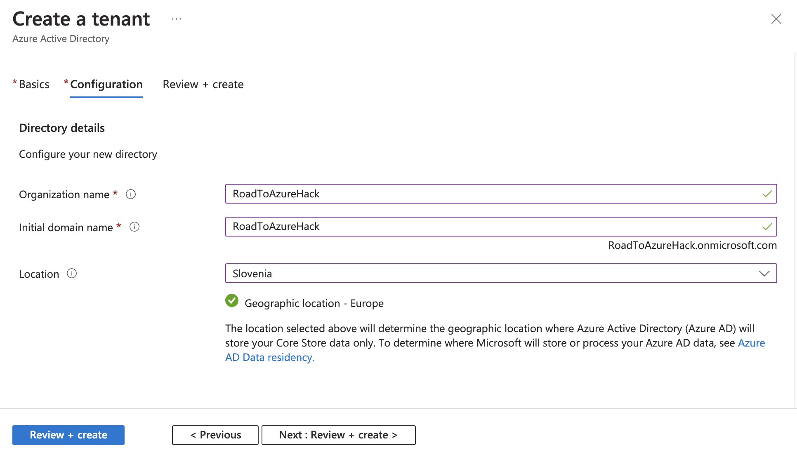
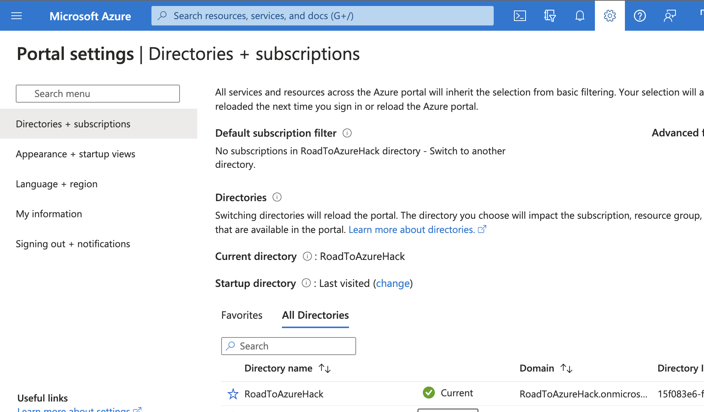
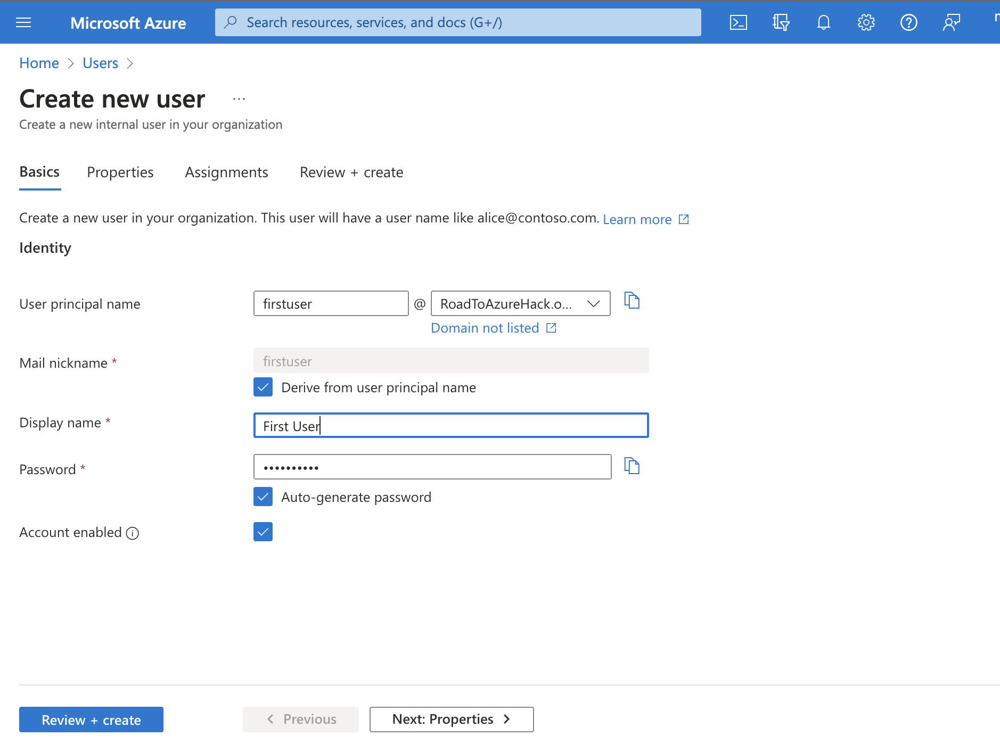
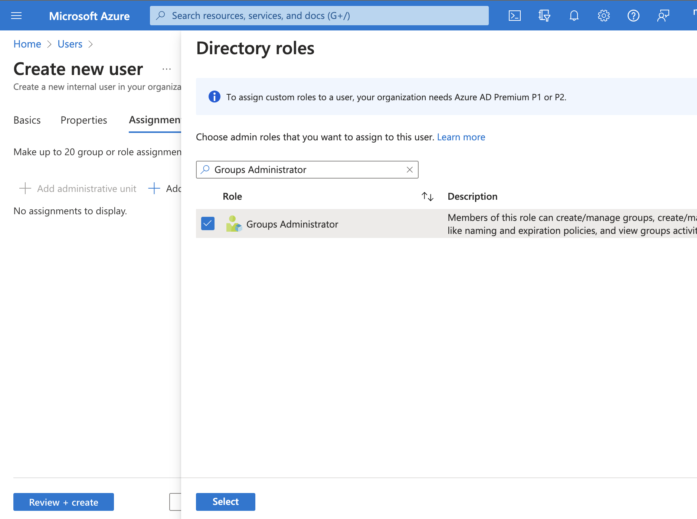
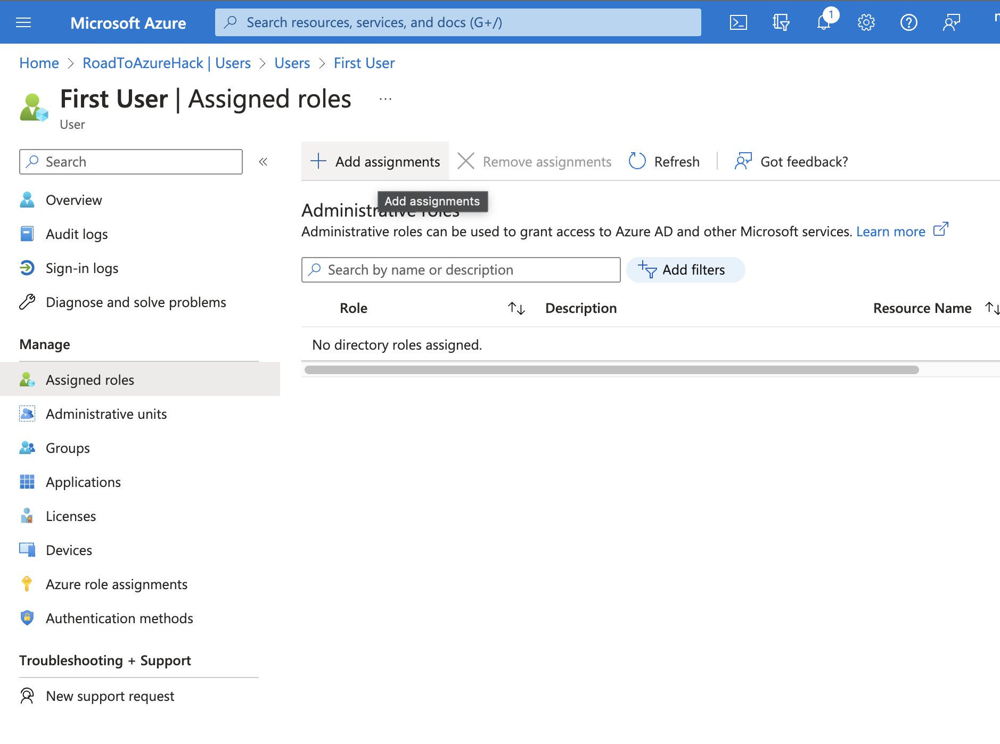
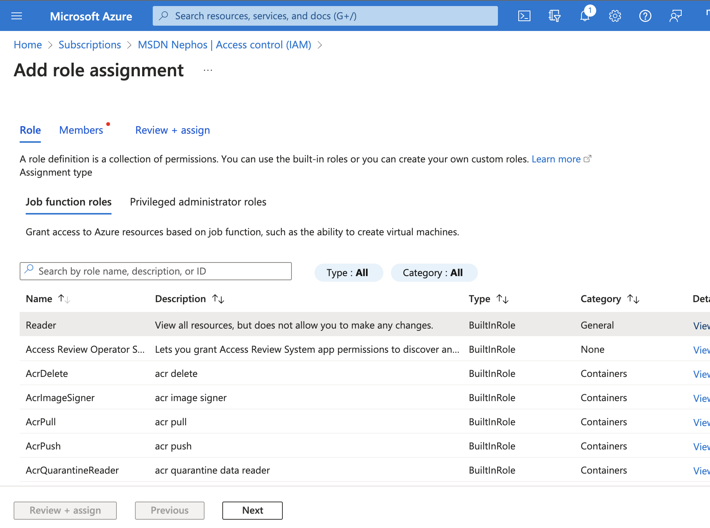
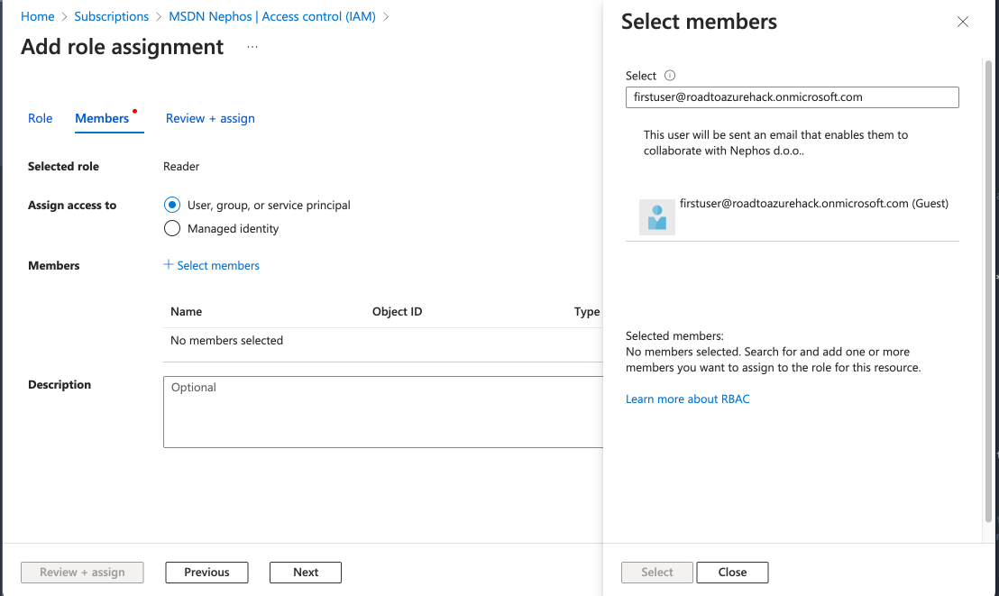
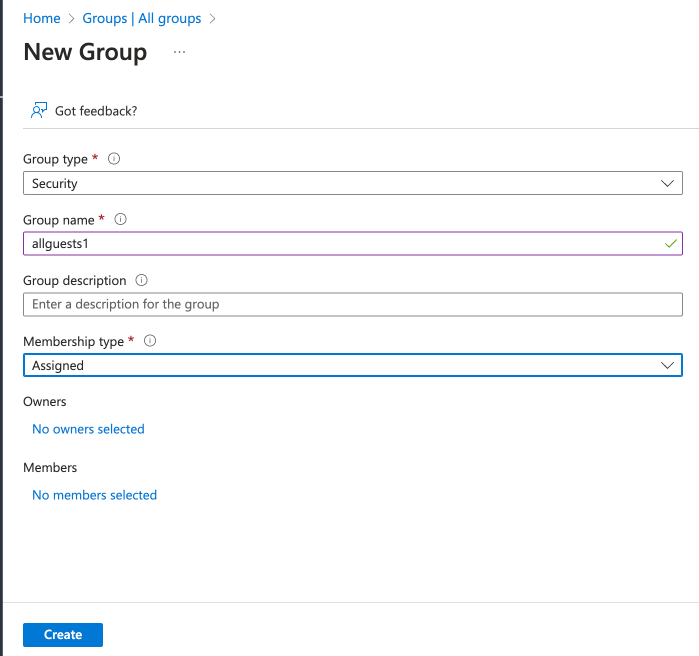
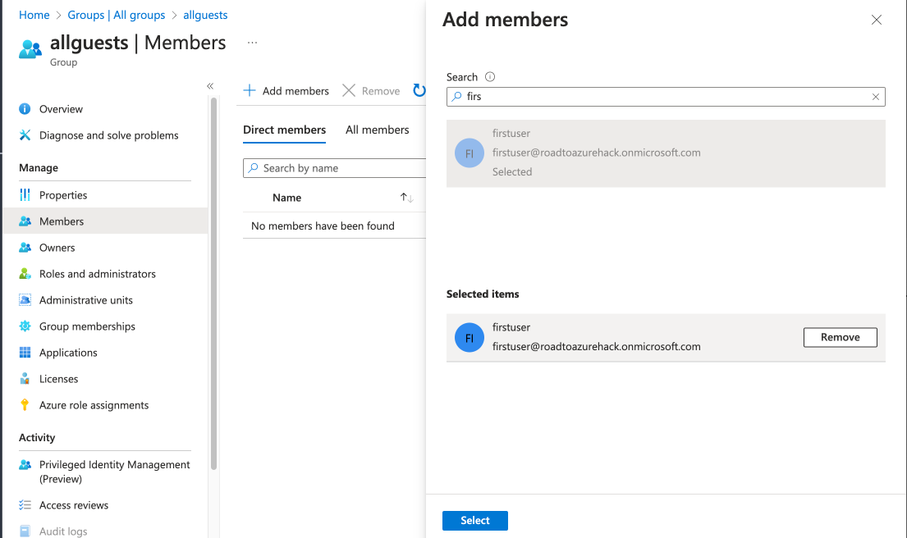

---
lab:
    title: '03 - Identities and governance'
    module: 'Azure Core'
---

# Lab 03 - Identities and governance

## Challenge scenario

You will learn fundamentals of Azure administration capabilities - Users, Role Based Access Control

First try to solve the challenges on your own, in case you have trouble, click on the arrow left of the challenge for a detailed guide or ask facilitator for help.

## Objectives

In this lab, you will:

+ Create a new Azure Active Directory tennant and a new AD user
+ Assign roles to the new user
+ Create an AD group

## Challenges

  
Create a new Azure Active Directory

1. Sign in to the [**Azure portal**](http://portal.azure.com).

1. In the Azure portal, search for and select **Azure Active Directory**:
1. Select **Manage tennants** and clikc Create:
1. Select Azure Active Directory and click Next: Configuration
1. Select a globaly unique name for your domain (note - it cannot be changed later!). The name will be <yourname>.onmicrosoft.com

    

  

  
Switch between directories

1. Click on the wheels icon top right

   

  

  
Create a new user "firstuser" in the new directory and assign him "Groups Administrator" permission

1. In the Azure portal, search for and select **Azure Active Directory**:
1. Make sure the right directory is created
1. Click Users in the left menu, New user, Create new user
1. Type the following values

    |Name|Value|
    |---|---|
    |User principal name| firstuser |
    |Display name| First User |

    

1. Click Next: Properties (you can fill optional infor)
1. Click Next: Asignments
1. Add Role and search for "Groups Administrator" and click select

    

1. Review + Create
1. alternatively, you can add group after the user is created via Assigned roles

    

  Note that we cannot add any Azure permission, since the thew Active Directory does not contain any subscriptions

  

  
Add the new user as a reader to your Azure subscription

1. Switch back to your original directory
1. Go to Subscriptions and choose your subscription
1. In the left menu, and click next

    

1. Click select Members and search for firstuser@<yourdomain>.onmicrosoft.com. Dobule click to select

    
1. Review + Assign

  

  
Login to Azure portal with the new user

1. Open an in private window
1. Navigate to portal.azure.com
1. Login (and change password if needed)
1. Switch directory to the directory with the subscription
1. View the subscription
1. Close the browser

  

  
Create a group called "allguests" for all **guest** users in your tenant and add "firstuser"

1. In the Azure portal, search for and select **Azure Active Directory**
1. Select Groups, New Group

    

1. Select allguests group and select Members in left menu
1. Select Add Members and find firstuser

    

  

  
Optional - add your private hotmail or gmail as a reader and add them to the allguests group

