---
lab:
    title: '04 - Storage'
    module: 'Azure Infrastructure'
---

# Lab 04 - Storage

## Challenge scenario

You will learn fundamentals of Azure Storage - how to create, manage and secure storage services

First try to solve the challenges on your own, in case you have trouble, click on the arrow left of the challenge for a detailed guide or ask facilitator for help.

## Objectives

In this lab, you will:

+ Create a new Azure Storage account and upload files to it
+ Create private and public storage accounts
+ Give temporary access to a storage account

## Challenges

  
Create a new Localy redundant Storage Account in Test Resource Group and a containter named Public. Create Directory "Images" and Upload 2 images that should be publically available. Create container Private and set access to 

1. Sign in to the [**Azure portal**](http://portal.azure.com).

1. In the Azure portal, search for and select **Storage Accounts** and click Create
1. Select Test Resource group, a globally unique name, and choose LRS for redundancy
1. Click Review+Create and wait for deployment. click go to resource

    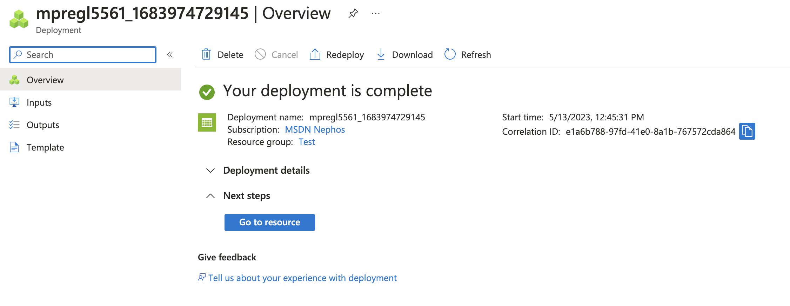

1. Select Storage Browser, blob containters and Add container. Name it "public" and select Public access level to Blob

    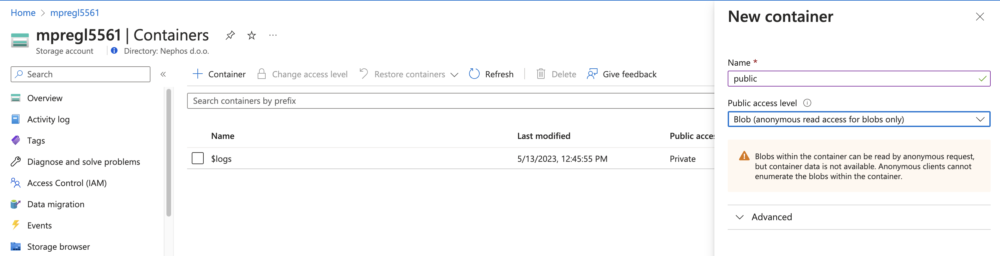

1. Select Add directory and name it images
1. Select Upload to drag and drop 2 images from your machine.

    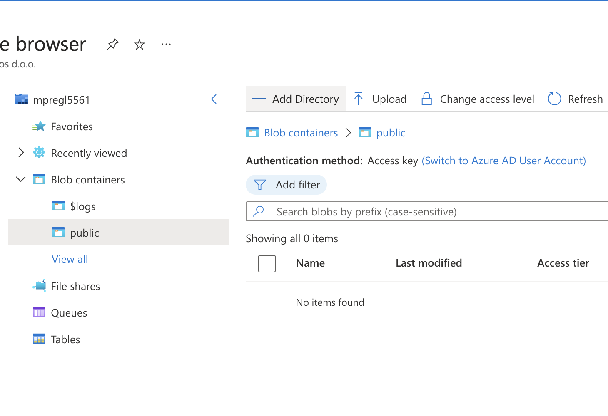
    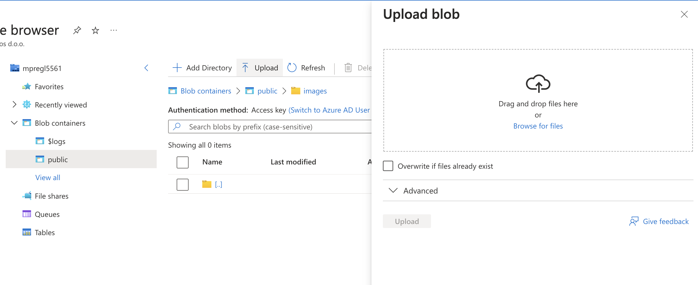
    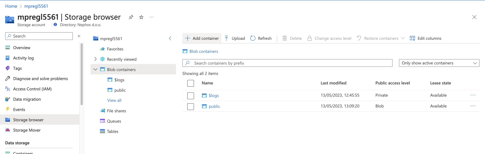

1. Select the image you uploaded and copy URL

    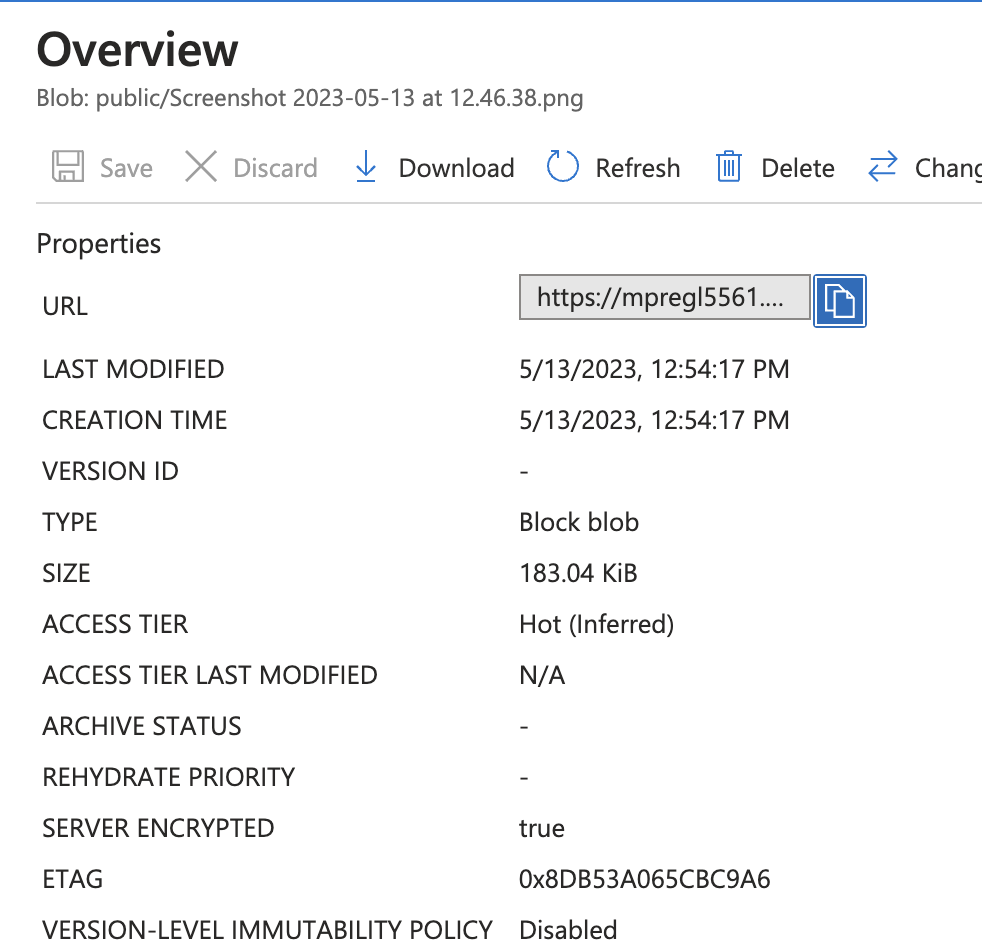

1. Open in private browsing and navigate to the url
1. Repeat the process to add container Private, with the access set to privte. Upload an image and copy URL

    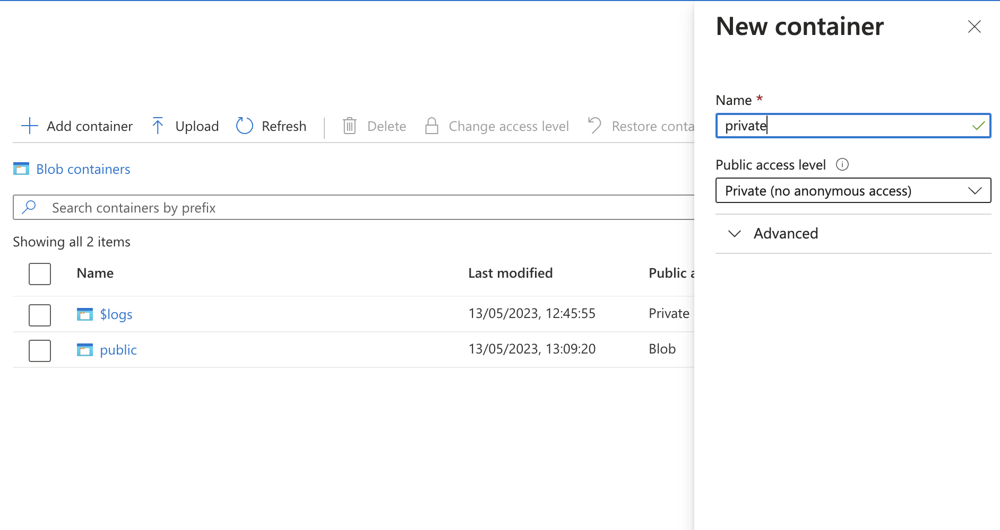
    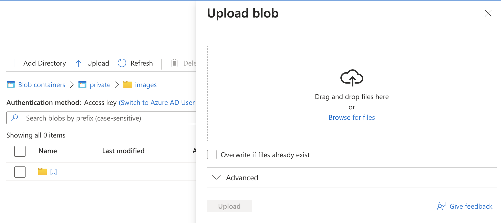

1. In private browser should not have access

    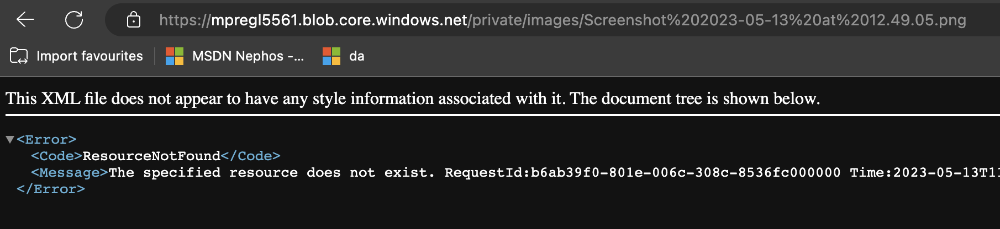

  

  
Generate temporary access (SAS token) for the private image for the next 8 hours

1. Select your storage account
1. Select "Containers" under Data storage in left menu and select "private" container
1. Select image you uploaded
1. Click Generate SAS
1. Click Generate SAS token and URL. Copy and test generated URL

    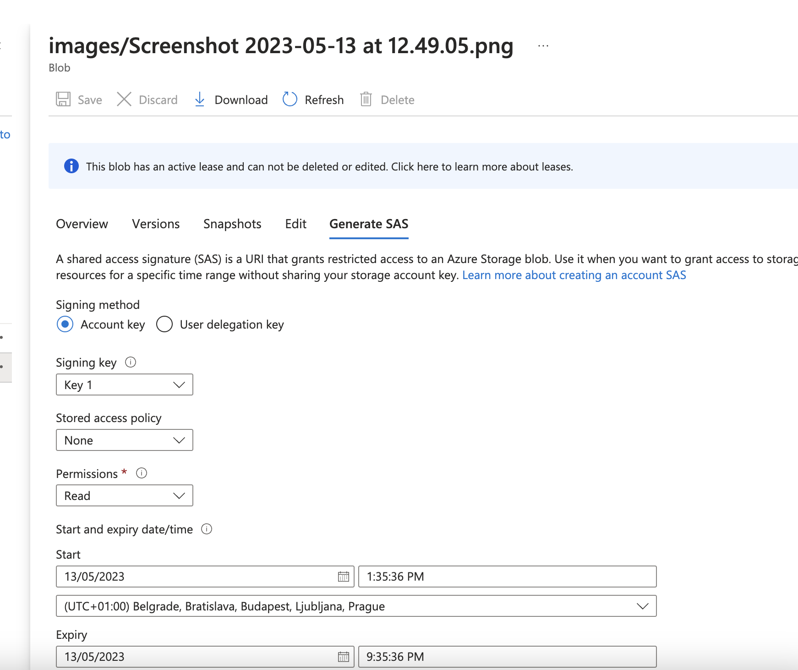
    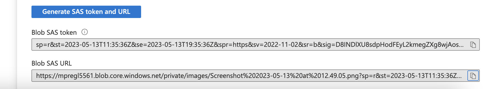

  

  
Change storage redundancy to Geo-Reduntand Storage

1. Select your storage account
1. Select "Redundancy" under Data management
1. Change Redudnacy to GRS and click Save

    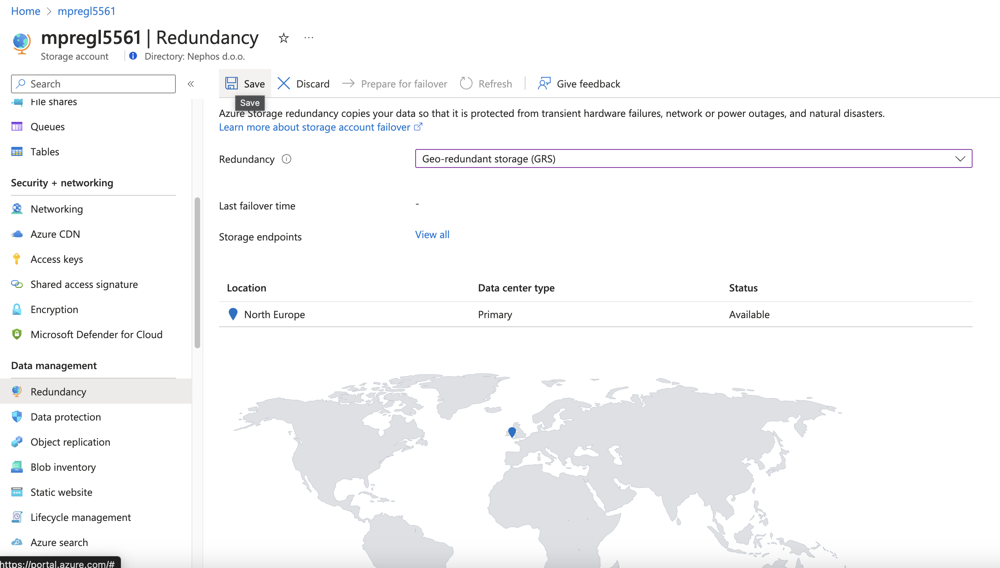

1. Observe the new copy of the data in West Europe

    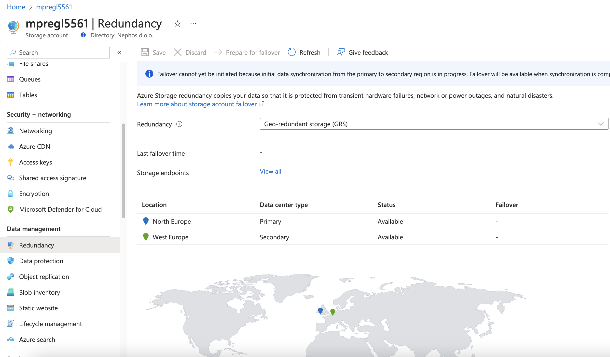

  

  
Clean up - delete the storage created in this excercise. Other services should remain as they will be needed for further excercises

1. Select your storage account
1. Select Delete in the top menu
1. Type the name to delete the Storage accound and all underlying objects. Confirm delete

    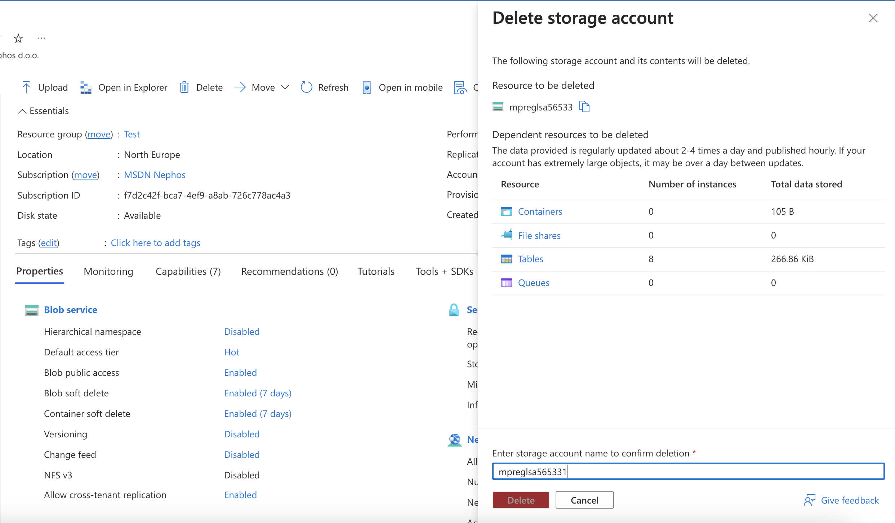

  
