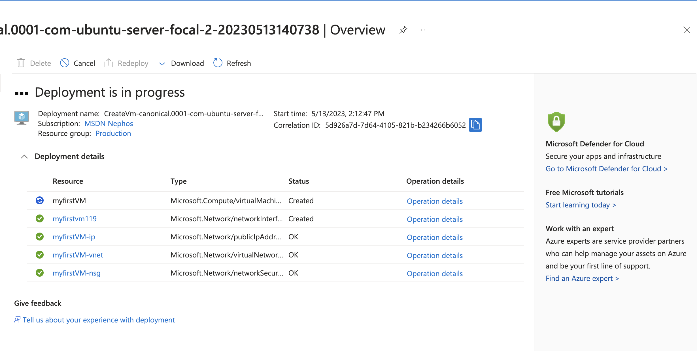
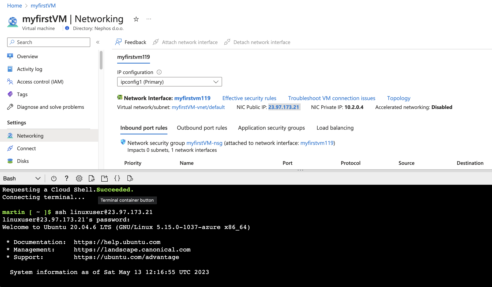
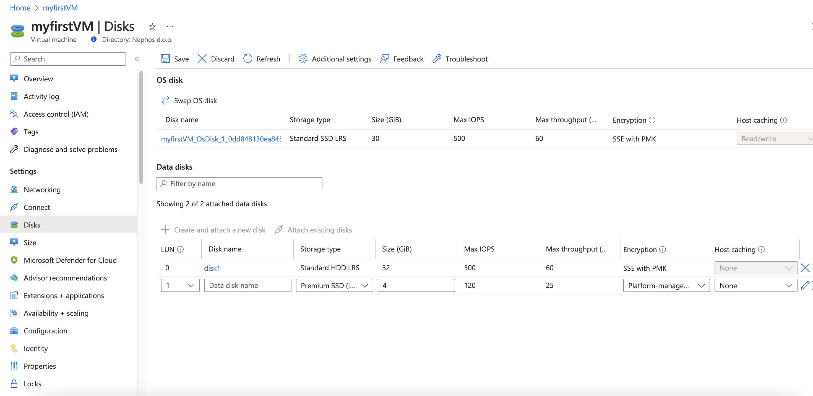
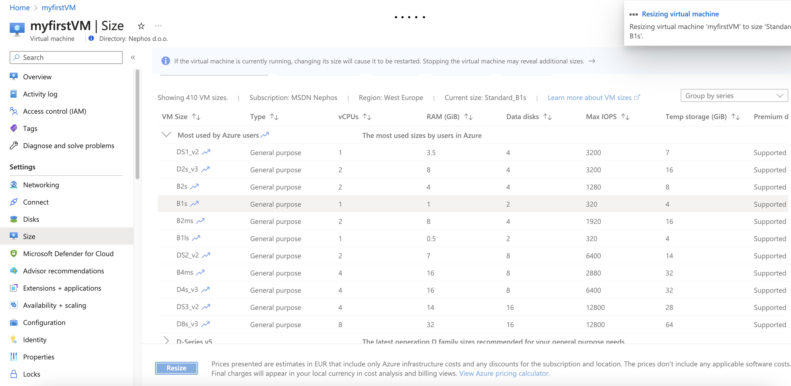
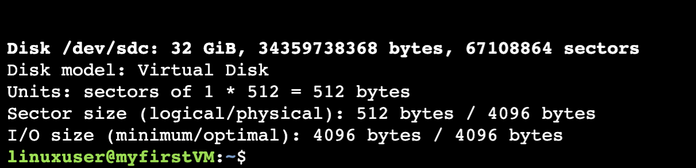
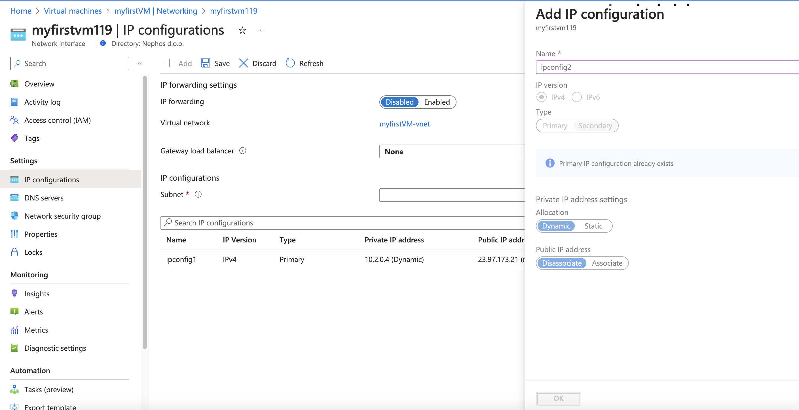
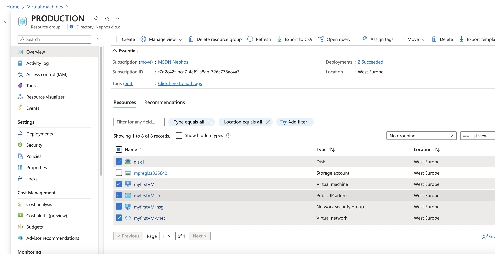
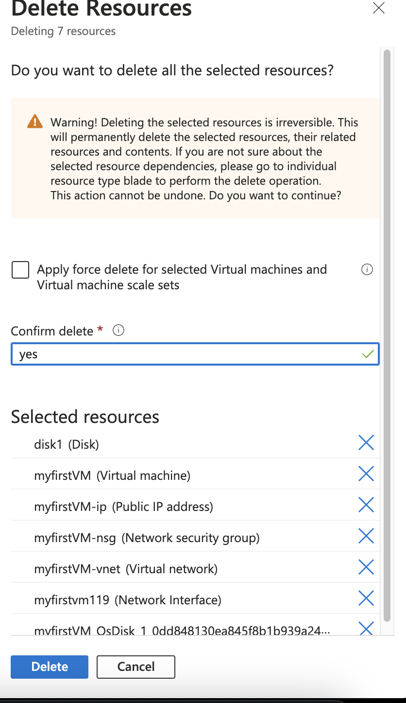
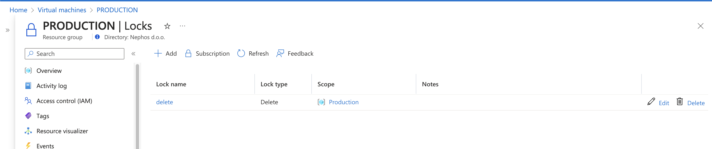

---
lab:
    title: '05 - Virtual Machines'
    module: 'Azure Infrastructure'
---

# Lab 05 - Virtual Machines

## Challenge scenario

You will learn fundamentals of Virtual Machines - How to create, select the right size and how to manage them. 

The solutions will not be provided - you should have enough experience by now to explore Azure Portal on your own. In case you do have trouble, there are some hints available, but you can also ask your facilitator for help.

## Objectives

In this lab, you will:

+ Create a new virtual machine
+ Explore different sitzes of Virtual machines

## Challenges

### Challenge 1 - your first VM

1. Create a new Virtual Machine with the following settings

    |Name|Value|
    |---|---|
    |Resource Group| Production |
    |Name| myfirstVM |
    |Image| Unitnut Server 20.04 LTS |
    |Size| B1ls |
    |Auth type| Password |
    |Username| linuxuser |
    |Password| Pa$$W0rd1234 |
    |OSDisk| Standard SSD, locally redundand |

    All other settings leave default for now. We will configure networking later

1. Get the public IP assigned to your VM
1. Connect to your VM via cloudshell (ssh linuxuser@<yourip> ) and ping 8.8.8.8. (ctry+c to stop)
1. Type Exit to disconnect

  
Hints

  

### Challenge 2 - attach a disk to VM and change size

1. Add 1 Disk - Standard HDD, 32 GB
1. Change size of the VM to B1s
1. Verify the disk has been added with "sudo fdisk -l" command

  
Hints

  

### Challenge 3 (optional) - add a second network interface

1. Go to Networking, Network interface , IP configurations

  
Hints

  

### Challenge 4 - Cleanup

1. Delete the Virtiual machine and all associated servcices created. Leave the "production" resource group

  
Hints

First remove the lock we created in challenge 2 ;)

  
