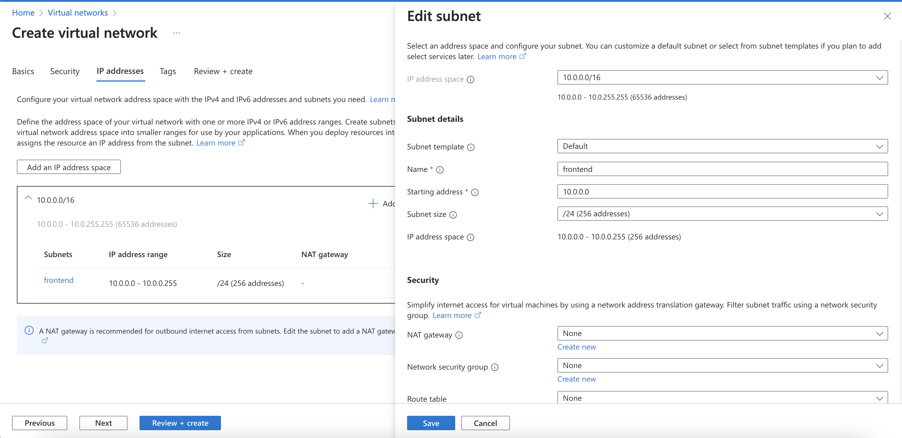
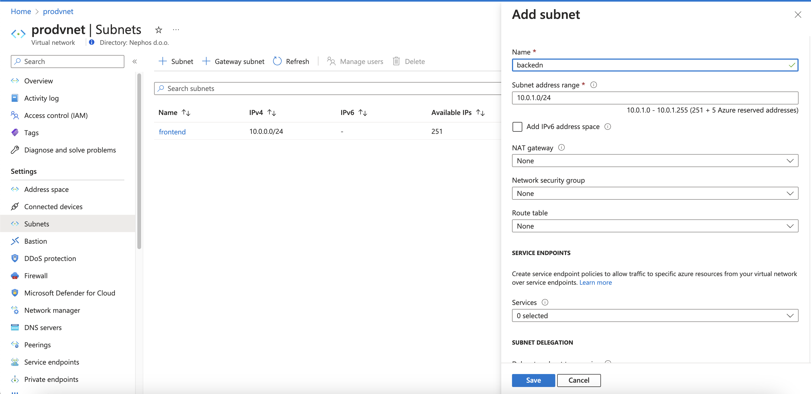
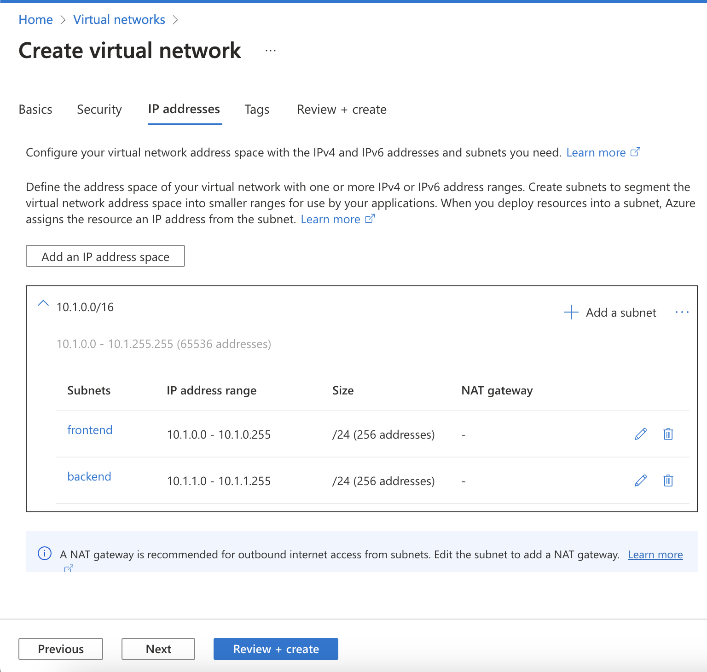
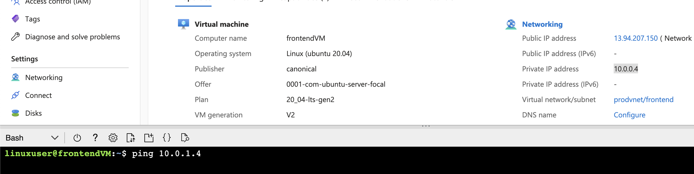
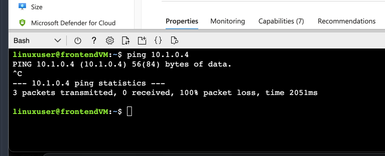
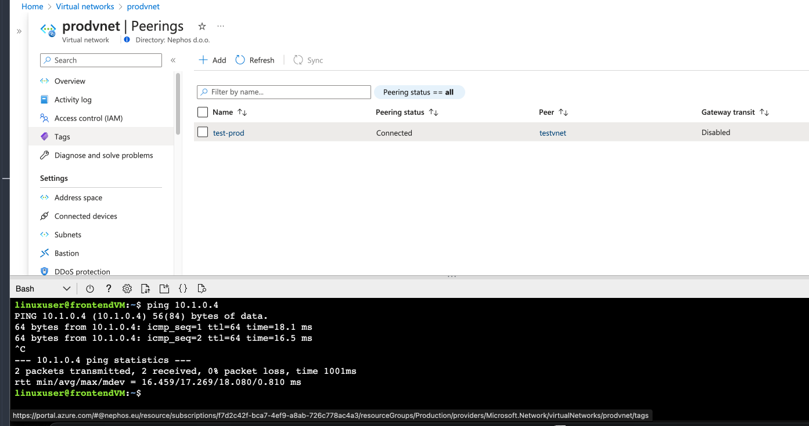

---
lab:
    title: '06 - Azure Networking'
    module: 'Azure Infrastructure'
---

# Lab 06 - Azure Networking

## Challenge scenario

You will learn fundamentals of Azure Networking. Your goal will be to create sfotware defined networking to support production and test workloads.

The solutions will not be provided - you should have enough experience by now to explore Azure Portal on your own. In case you do have trouble, there are some hints available, but you can also ask your facilitator for help.

## Objectives

In this lab, you will:

+ Create a new virtual network
+ Create a subnet
+ Place resources in subnets
+ Connect VNET together

## Challenges

### Challenge 1 - First, virtual networks

1. Create a new Virtual Network in Production

    |Name|Value|
    |---|---|
    |Name| prodvnet |
    |IP Adderess space| 10.0.0.0/16 |
    |Subnet - rename to frontend | 10.0.0.0/24 |

1. Add a subnet named "backend" with 10.0.1.0/24 

1. Create a new Virtual Network in Test

    |Name|Value|
    |---|---|
    |Name| testvnet |
    |IP Adderess space| 10.1.0.0/16 |
    |Subnet - rename to frontend | 10.1.0.0/24 |

1. Add a subnet named "backend" with 10.1.1.0/24 

  
Hints

when creating testvnet, you will need to delete the assigned IP address space first

    

  

### Challenge 2 - Deploy our production 

1. VM 1 - Production frontend

    |Name|Value|
    |---|---|
    |Resource Group| Production |
    |Name| frontendVM |
    |Image| Unitnut Server 20.04 LTS |
    |Size| B1ls |
    |Auth type| Password |
    |Username| linuxuser |
    |Password| Pa$$W0rd1234 |
    |OSDisk| Standard SSD, locally redundand |
    |Virtual network| prodvnet |
    |Subnet| frontend |

    Make sure to place in the right network and subnet!

    write down both IP address-es - public and private (should be 10.0.0.4)

1. VM 2 - Production backend

    |Name|Value|
    |---|---|
    |Resource Group| Production |
    |Name| backendVM |
    |Image| Unitnut Server 20.04 LTS |
    |Size| B1ls |
    |Auth type| Password |
    |Username| linuxuser |
    |Password| Pa$$W0rd1234 |
    |OSDisk| Standard SSD, locally redundand |
    |Public inbound port| none |
    |Virtual network| prodvnet |
    |Subnet| backend |
    |PublicIP| none |

    Make sure to place in the right network and subnet. The public inbound port should be set to **none**, as backend machines shoudl not be publically accessible. Also, no public IP.

    write down the privateIP address - it should be 10.0.1.4

  
Hints

  

### Challenge 3 ping one machine from another

1. Use Cloud Shell to login to frontendVM (ssh linuxuser@<public IP>)
1. use "ping <ip of the backendVM>"
1. keep the cloud shell open, but you can minimize it

  
Hints

  

### Challenge 4 - A test VM

1. Create new VM in the Test resource group (no public IP address)

    |Name|Value|
    |---|---|
    |Resource Group| Production |
    |Name| testVM |
    |Image| Unitnut Server 20.04 LTS |
    |Size| B1ls |
    |Auth type| Password |
    |Username| linuxuser |
    |Password| Pa$$W0rd1234 |
    |OSDisk| Standard SSD, locally redundand |
    |Public inbound port| none |
    |Virtual network| testnet |
    |Subnet| frontend |
    |PublicIP| none |

    write donw the private IP of the virtual machine. It should be 10.1.0.4

1. After deployment, return to Cloud Shell
1. Ping 10.1.0.4 - it is unable to ping it

  
Hints

  

### Challenge 5 - Connect the VNETs together

1. Go to prodvnet and select Peerings
1. Add peering 

    |Name|Value|
    |---|---|
    |Peering link name(2x)| test-prod |
    |PVirtual Network| testvnet |

1. Wait for peering status to update (connected)
1. After deployment, return to Cloud Shell
1. Ping 10.1.0.4 - since the vnets are now connected to eachg other, you can ping from production to test

  
Hints

  

### Challenge 6 - Cleanup

1. Delete all resources in the subscription - easiest is to delete both Production and Test resource groups

