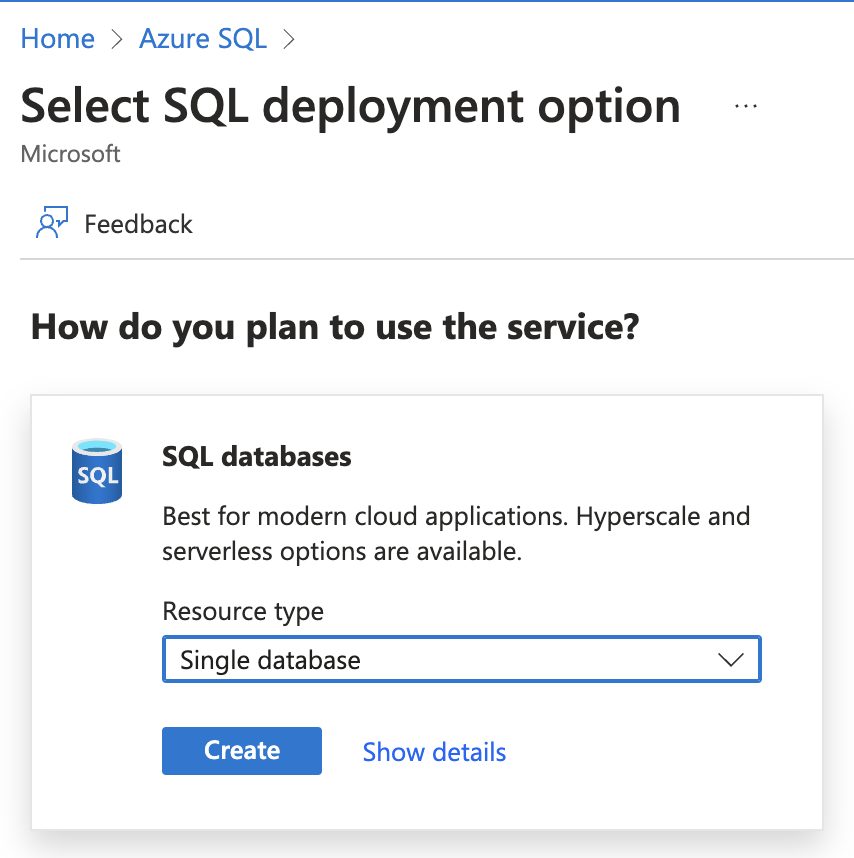

---
lab:
    title: '08 - Databases'
    module: 'App services'
---

# Lab 08 - Databases

## Challenge scenario

You have been tasked with providing the database platform for the previously deployed web site. You will use PaaS services for this part as well

The solutions will not be provided - you should have enough experience by now to explore Azure Portal on your own. In case you do have trouble, there are some hints available, but you can also ask your facilitator for help.

## Objectives

In this lab, you will:

+ Create an managed server and a database
+ backup a database

## Challenges

### Challenge 1 - Our first database

1. Create a new Azure SQL
1. Select SQL Databases

    |Name|Value|
    |---|---|
    |Name| myfirstdb |

    Create a new Server

    |Name|Value|
    |---|---|
    |Location| West Europe |
    |Name| (unique name) |
    |Azure AD Admin| (find your id) |

    Back under Create SQL, Under Additional settings select Use Existing Data - Sample

1. Review + Create, go to resource

  
Hints

1. Create a new Azure SQL
1. Select SQL Databases

    
    

    Back under Create SQL, Under Additional settings select Use Existing Data - Sample  

    

1. Review + Create, go to resource

  

### Challenge 2: configure access and connect to the database
We have our DB created, now we will connections from the internet. NEVER do this in production unless you understand what you are doing

1. On DB home page, click Configure Access
1. On Public Access, click "Selected networks"
1. Add your client IP address to allow connections
1. Select Allow Azure Services to access this server
1. Back to your DB and click Query Editor, login as yourself
1. Test with a sample query (select * from [SalesLT].[Customer])

  
Hints

We have our DB created, now we will connections from the internet. Again, NEVER do this in production unless you understand what you are doing

1. On DB home page, click Configure Access

    

1. On Public Access, click "Selected networks"
1. Add your client IP address to allow connections
1. Select Allow Azure Services to access this server

    

1. Back to your DB and click Query Editor, login as yourself
    
1. Test with a sample query (select * from [SalesLT].[Customer])

  

### Challenge 3: find connection strings

1. Find connection strings :)
1. If you are allowed on your PC, install Azure Data Studio [link](https://learn.microsoft.com/en-us/sql/azure-data-studio/download-azure-data-studio?view=sql-server-ver16&tabs=redhat-install%2Credhat-uninstall)
1. Connect to your DB server

  
Hints

1. Find connection strings :)
    

1. If you are allowed on your PC, install Azure Data Studio [link](https://learn.microsoft.com/en-us/sql/azure-data-studio/download-azure-data-studio?view=sql-server-ver16&tabs=redhat-install%2Credhat-uninstall)
1. Connect to your DB server

    

    

  

### Challenge 4 - Backup your Database

1. Create a new storage account for the backup

1. Use Export to backup a DB

1. Select the storage account
1. Create a container named backup

1. Pick a password to backup
1. Check on the backup progress on the **server**

  
Hints

1. Create a new storage account for the backup
    
1. Use Export to backup a DB
    
1. Select the storage account
1. Create a container named backup
    
1. Pick a password to backup

1. Check on the backup progress on the **server**

    

  
